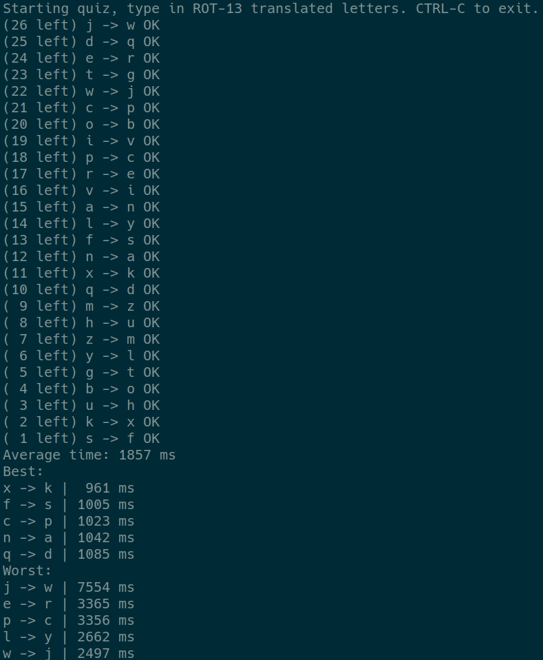

# ROT-13 cipher trainer

This is a game, where you time yourself in translating leters using ROT-13 cipher.

To try it out, run the script directly (Ruby is required on the system), or via temporary Docker:
```
    docker run --rm -v $(pwd):/code -ti ruby:alpine ruby /code/rot13.rb
```


